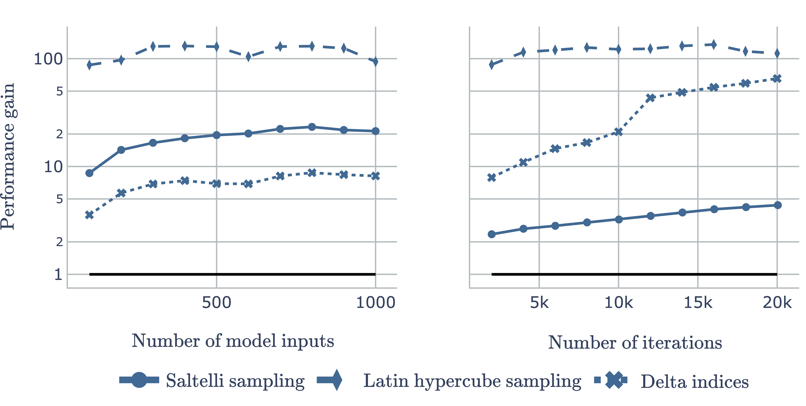

.. _speedups:

Speed-up gains
==============

Figure below shows performance gains of ``gsa_framework`` compared to ``SALib`` in two scenarios: with respect to increasing number of model inputs with constant iterations on the left, and increasing number of iterations given constant inputs on the right. Gains are computed as ratios between the time needed by ``SALib`` to the time needed by ``gsa_framework`` to generate Saltelli sampling, latin hypercube design, and compute delta indices. Note that y-axis has a logarithmic scale. In all cases, gain is higher than one, which points to higher efficiency of ``gsa_framework``.

